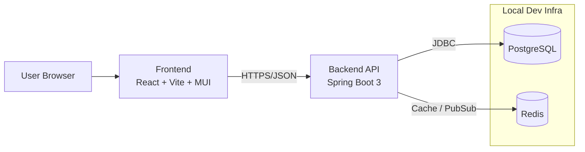

# Enterprise Inbox Intelligence Platform

Monorepo for an enterprise-grade inbox intelligence system with a modern web UI, backend API, and local infrastructure dependencies.

## Monorepo Structure

```text
.
├─ frontend/                  # React 18 + TypeScript + Vite + MUI
├─ backend/                   # Spring Boot 3 + Java 17
├─ infra/                     # docker-compose + local dev scripts
├─ .github/workflows/         # CI placeholders
├─ CONTRIBUTING.md            # Conventional commits guidance
└─ README.md
```

## Architecture

- `frontend` consumes REST APIs exposed by `backend`.
- `backend` persists relational data in PostgreSQL and uses Redis for caching/session-style workloads.
- `infra` provisions local Postgres + Redis for development.

### Component Diagram



## Local Development

### Prerequisites

- Node.js 20+
- Java 17+
- Docker Desktop

### 1) Start infra

PowerShell:

```powershell
./infra/scripts/dev-up.ps1
```

Bash:

```bash
./infra/scripts/dev-up.sh
```

### 2) Run backend

```bash
cd backend
gradle bootRun
```

Default backend URL: `http://localhost:8080`

### 3) Run frontend

```bash
cd frontend
npm install
npm run dev
```

Default frontend URL: `http://localhost:5173`

### 4) Stop infra

PowerShell:

```powershell
./infra/scripts/dev-down.ps1
```

Bash:

```bash
./infra/scripts/dev-down.sh
```

## CI Placeholders

- Frontend pipeline placeholder: `.github/workflows/frontend-ci.yml`
- Backend pipeline placeholder: `.github/workflows/backend-ci.yml`

These are intentionally lightweight placeholders to be expanded with full lint/test/release gates.